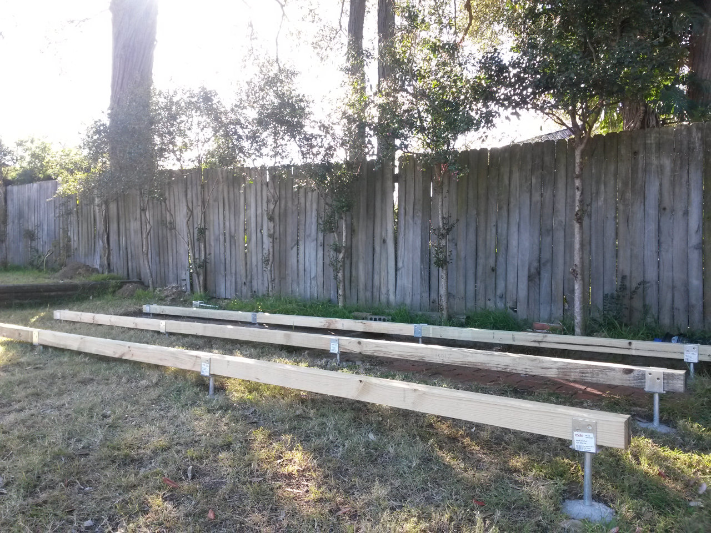
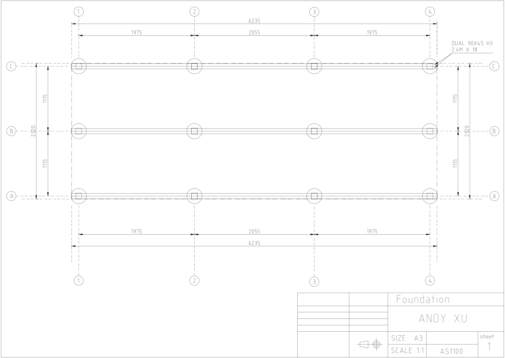
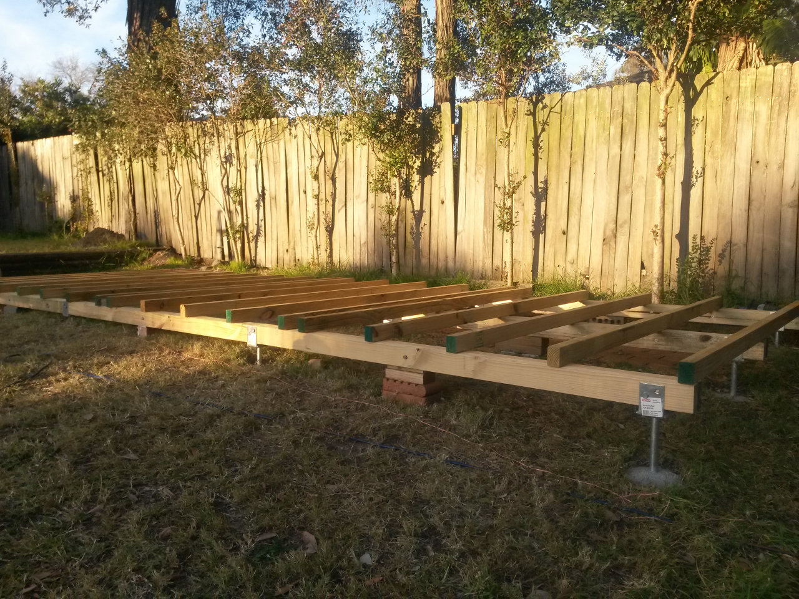
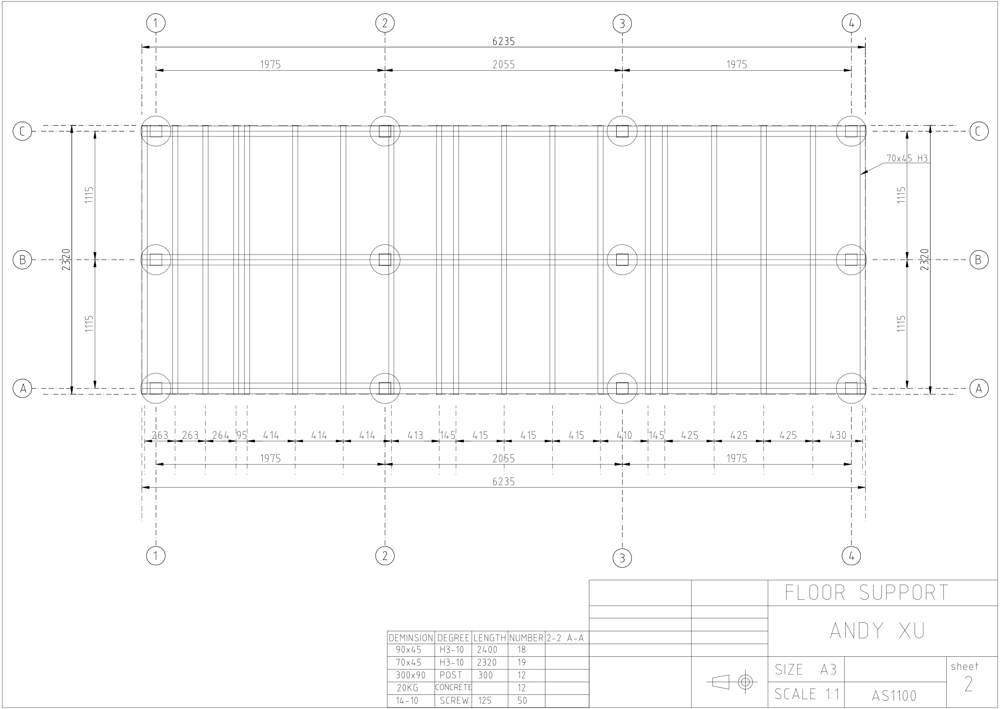
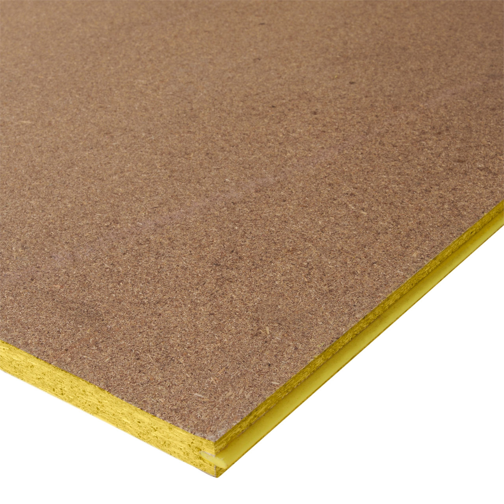
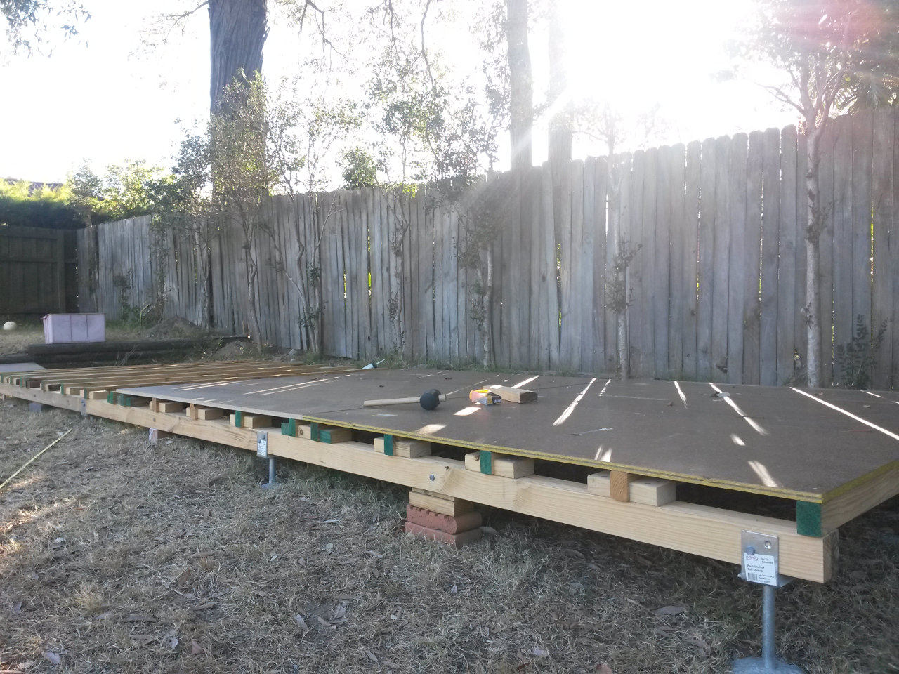
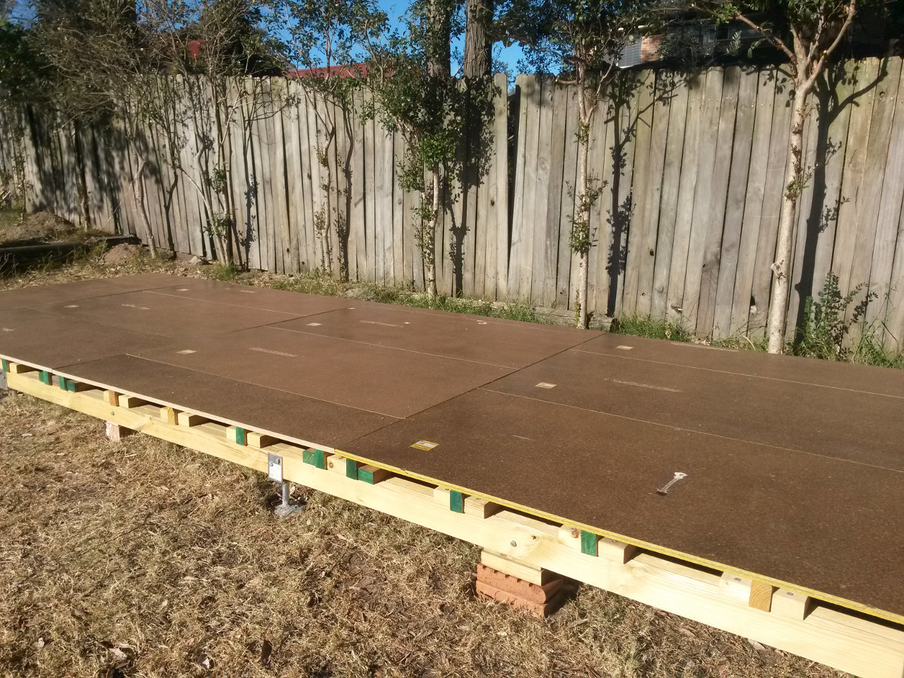
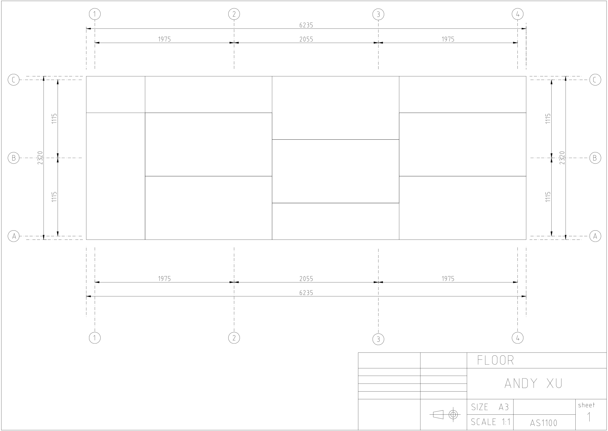
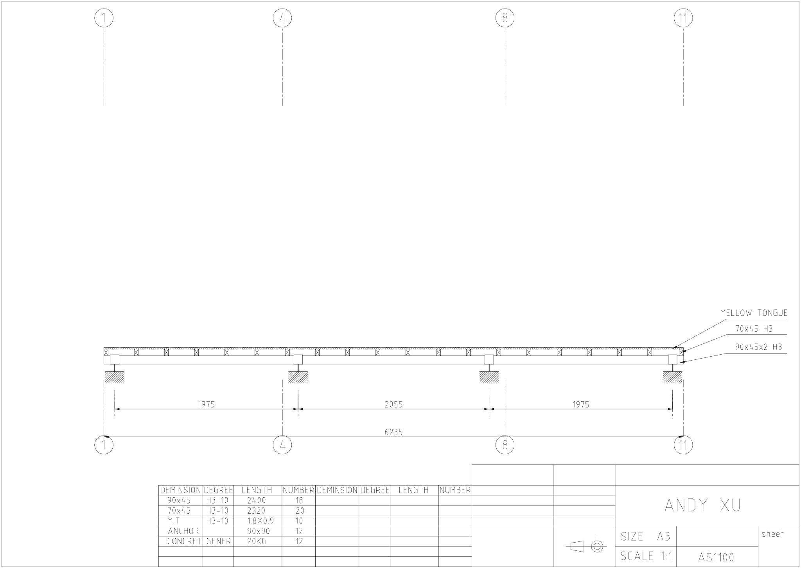
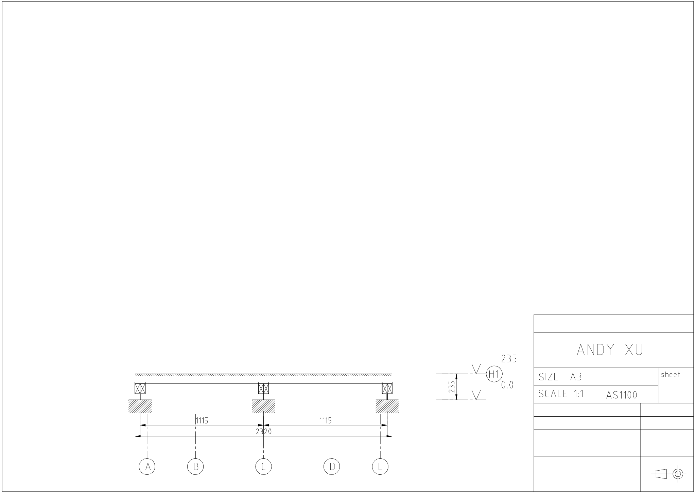

# Build the foundation

Not all sheds need to build a foundation. If you are lucky and have a flat concrete slab, 
you may just bolt it on the ground. Some hobby products even simply seat the shed on a couple
of bricks, which still can last a few years. My problem is a slope of grasses. 
I have to level it before anything starts. So here is the solution:

Dig 12 holes after measurement, the hole is roughly 30cm in diameter and 40cm in depth. 
Fill the holes with concrete and the post anchor. 20kg concrete each hole should be fine.
Level and align these post anchors carefully before the concrete is set.

The post anchor looks like this:

The inside dimension is 90x90mm so a 90x90mm timber beam can be right sit on it.

My post anchor array looks like this:

The plan can be found in <a href="./plan_post_anchor.dxf">plan_post_anchor.dxf</a>.

The concrete normally curds in 24 hours. However you'd better wait for 7 days to reach 80%
strength. Then the support beam can be laid on the post anchor and secured by bolts.
The total length of the beam is 6.2 meters. If you feel it's hard to find/process/transport 
this long beam, you may split it to 3 sections and each secure to the post. Be careful with
the conjunction, make it level and flat. By the way it's also a good chance to level your
foundation by inserting some hard material between beam and post.
If you have the 90x90 timber that would be great. Otherwise like me I used two 90x45 H3 
timber binding together, which is easier to cut and slightly cheaper than 90x90. 
This is my support beam:

The plan can be found in <a href="./plan_support_beam.dxf">plan_support_beam.dxf</a>.

The joinsts are sitting on the support beams to support the floor. 
It's a rather simple process, just nail those 70x45x2320 H3 timbers on the beam.
Please note my joinsts were not evenly spreaded on the beam, which was adjusted 
for support the edge of the floor boards. 
You don't have to do this. You may nail your joists evenly then adding some extra
joists to support the edge.

The plan can be found in <a href="./plan_floor_joinst.dxf">plan_floor_joinst.dxf</a>.

The floor is structural grade particleboard sheet so called Yellow Tongue,
which is named by its yellow edge.

The Yellow Tongue sheet can be as large as 3600x900mm. Surely the bigger the better
so just pick the size suits you. I chosed 1800x900 because it's lighter.

<table>
  <tr>
    <td align="left"></td>
    <td align="right"></td>
  </tr>
</table>

The plan can be found in <a href="./plan_floor.dxf">plan_floor.dxf</a>.

The front view and the side view can be found in 
<a href="./elevation_front.dxf">elevation_front.dxf</a> and
<a href="./elevation_side.dxf">elevation_side.dxf</a>.

<table>
  <tr>
    <td align="left"></td>
    <td align="right"></td>
  </tr>
</table>

