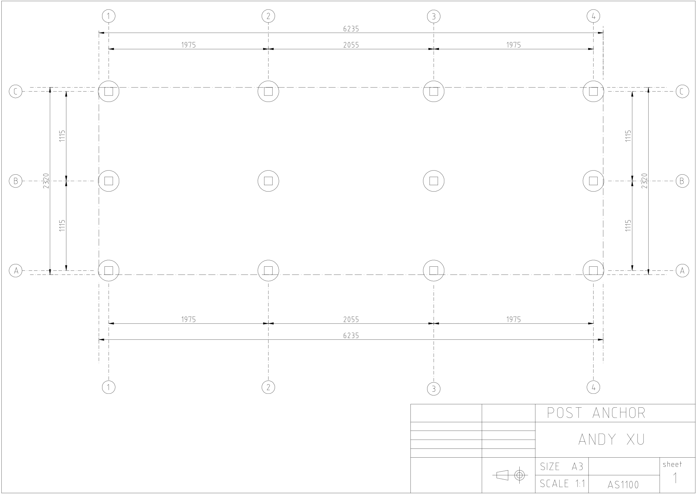

# Build the foundation

Not all sheds need to build a foundation. If you are lucky and have a flat concrete slab, 
you may just bolt it on the ground. Some hobby products even simply seat the shed on a couple
of bricks, which still can last a few years. My problem is a slope of grasses. 
I have to level it before anything starts. So here is the solution:

Dig 12 holes after measurement, the hole is roughly 30cm in diameter and 40cm in depth. 
Fill the holes with concrete and the post anchor. 20kg concrete each hole should be fine.
Level and align these post anchors carefully before the concrete is set.

The post anchor looks like this:

The inside dimension is 90x90mm so a 90x90mm timber post can be right sit on it.

My post anchor array looks like this:

You may find the plan in "plan_post_anchor.dxf":

