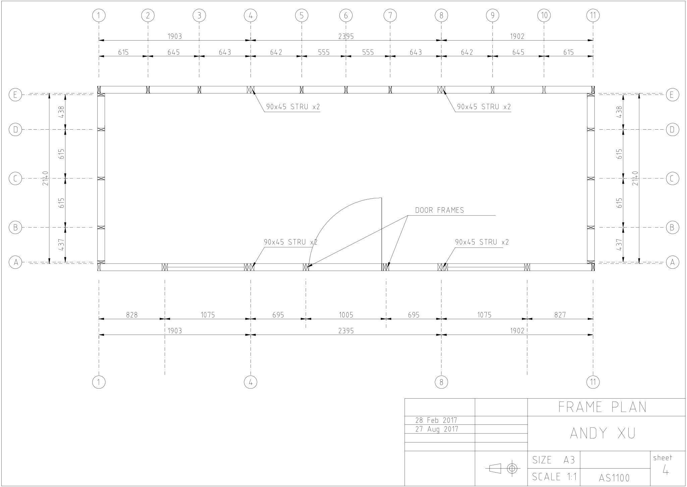
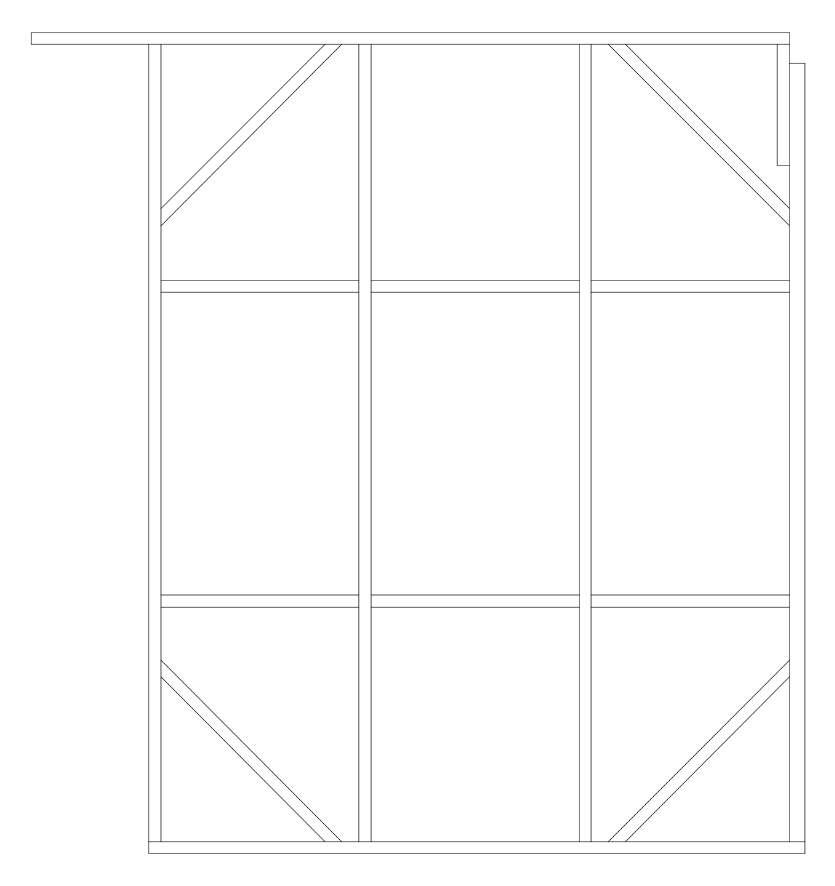
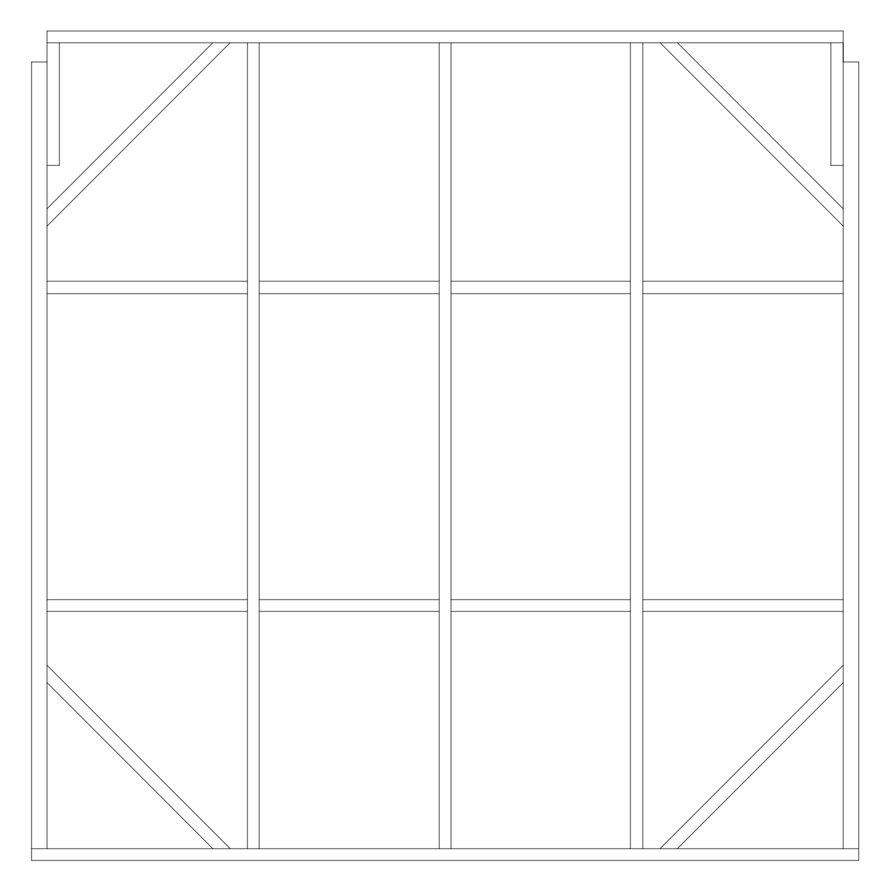
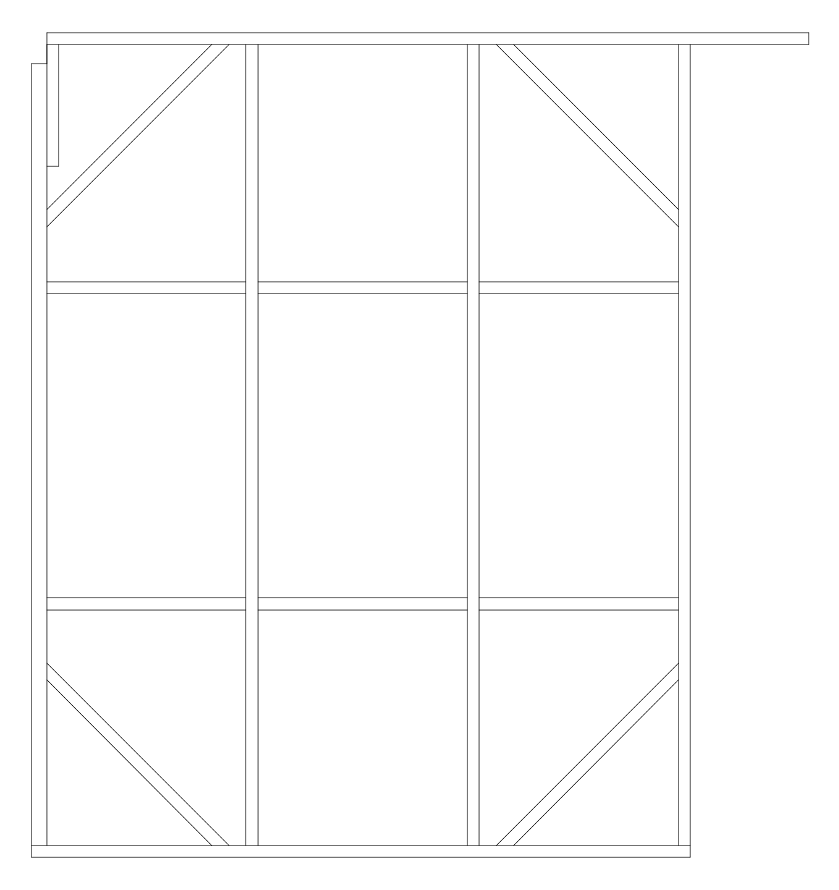
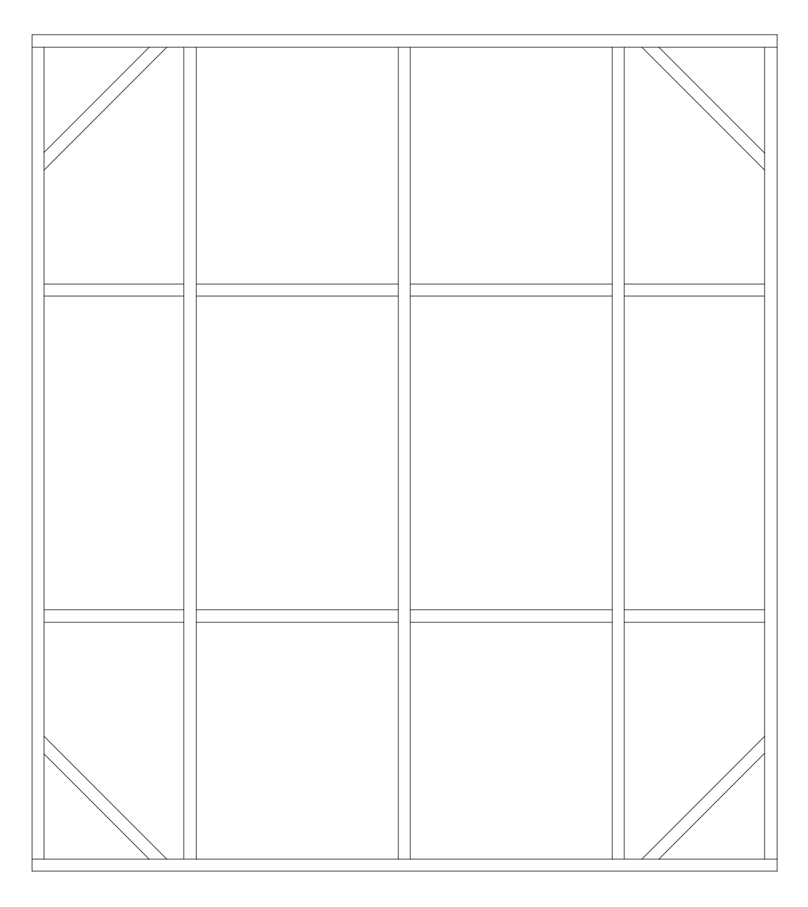
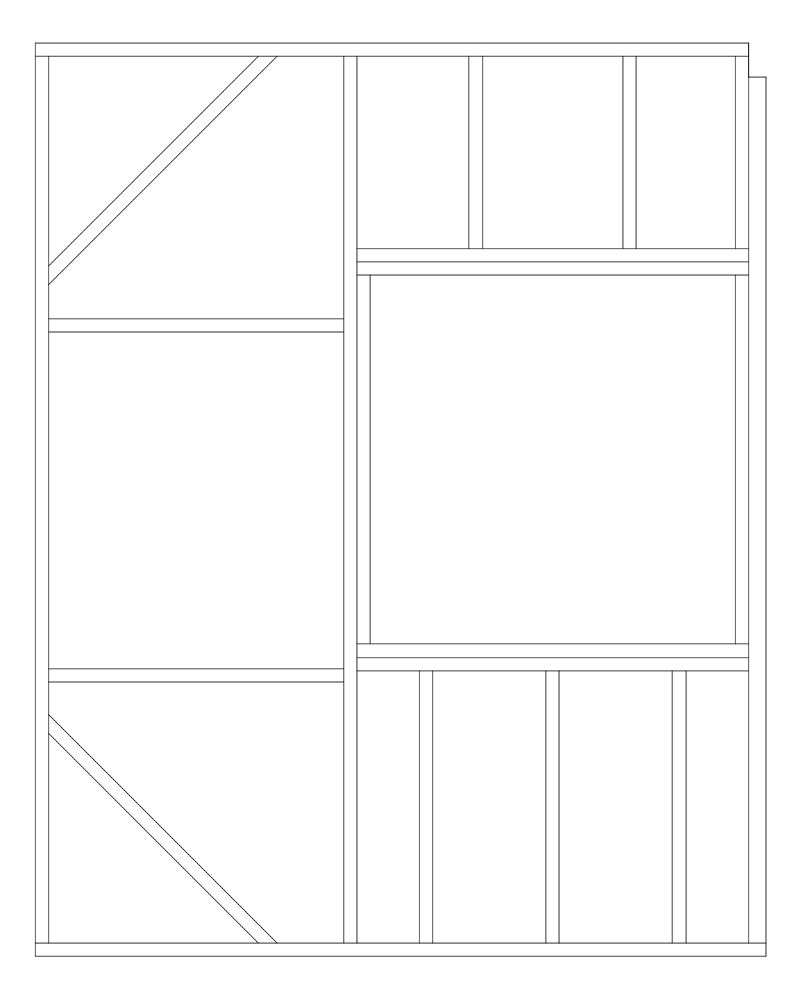
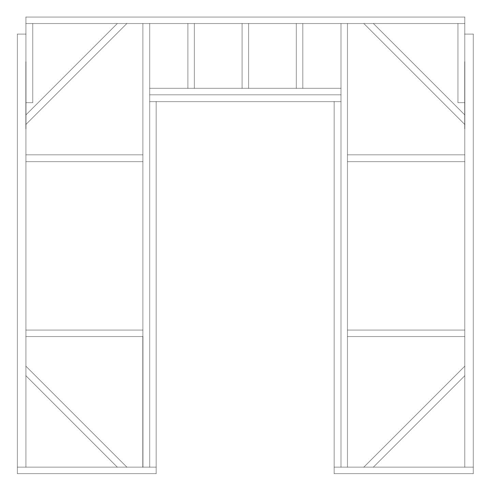
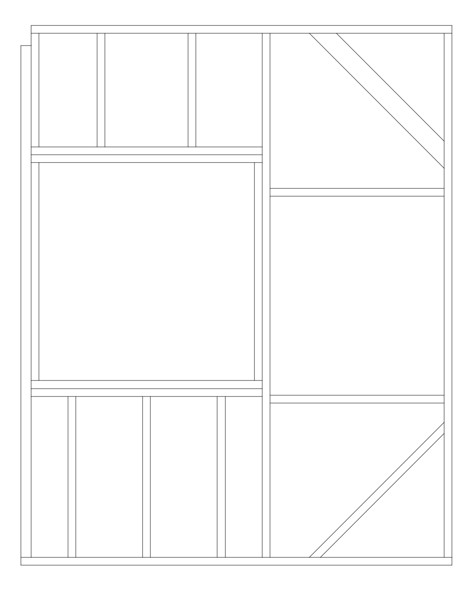

# The Frame of the Wall Structure

The dimension of the shed is 6235 * 2320 * 2400 in millimeters. 
Building a 6 meters wall frame would be quite challenging for a hobby project.
So I splitted the wall frames to 8 pieces, each 4 square meters around.

Here is the frame plan in window line:

The CAD file can be found in <a href="./plan_frame.dxf">plan_frame.dxf</a>.

The 8 pieces are A1-A4, A4-A8, A8-A11, E1-E4, E4-E8, E8-E11 and two A-E.

<table>
  <tr>
    <td align="left"></td>
    <td align="center"></td>
    <td align="right"></td>
  </tr>
  <tr>
    <td align="left"></td>
    <td align="center"></td>
    <td align="right"></td>
  </tr>
  <tr>
    <td align="left"></td>
    <td align="center"></td>
    <td align="right"></td>
  </tr>
</table>

Note that
* Most timbers are 90x35mm except 8 timbers in A4, A8, E4 and E8 are 90x45mm.
* The 90x45mm notch in above panels, except the A-E panel, are reserved for the cross over beams.
* The 345mm extension in the upper panel of E1-E4 and E8-E11 are part of the roof structure.
* Do NOT tighten or install the triangle supports before those panels were nailed together.

