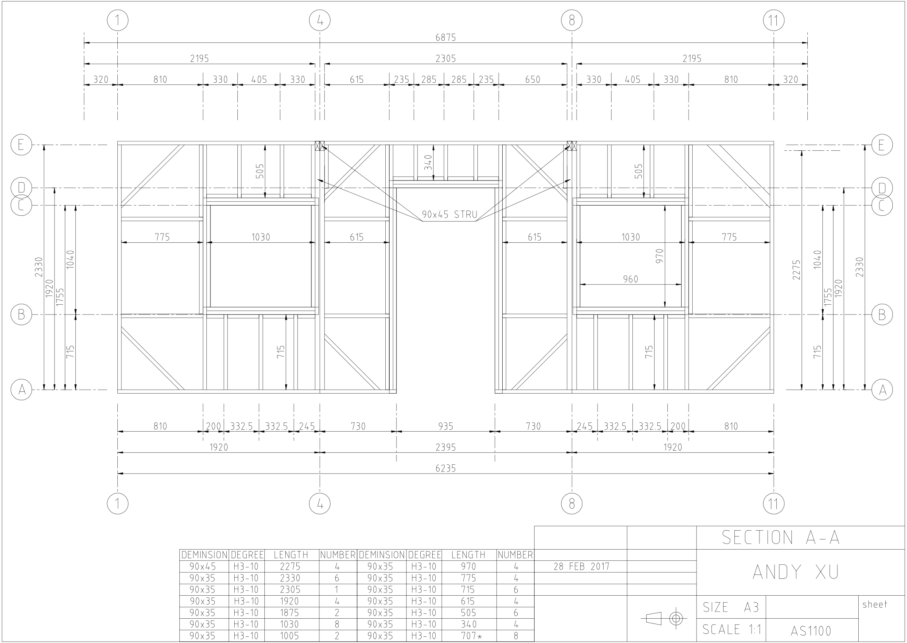
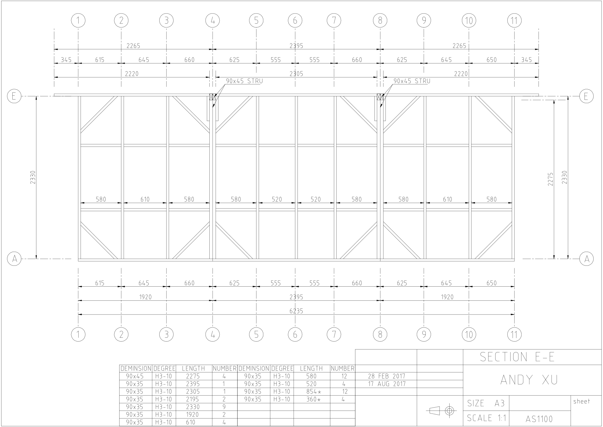
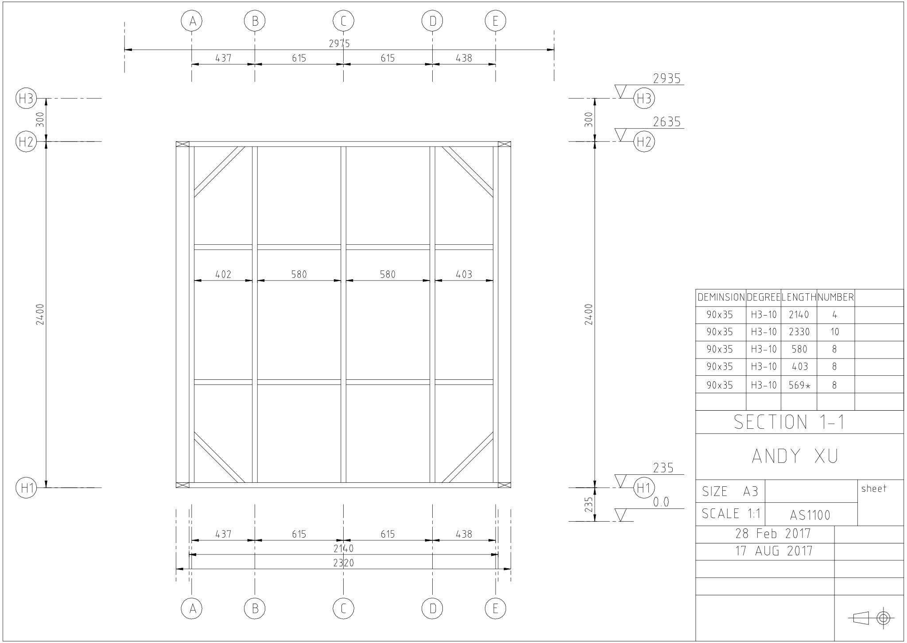
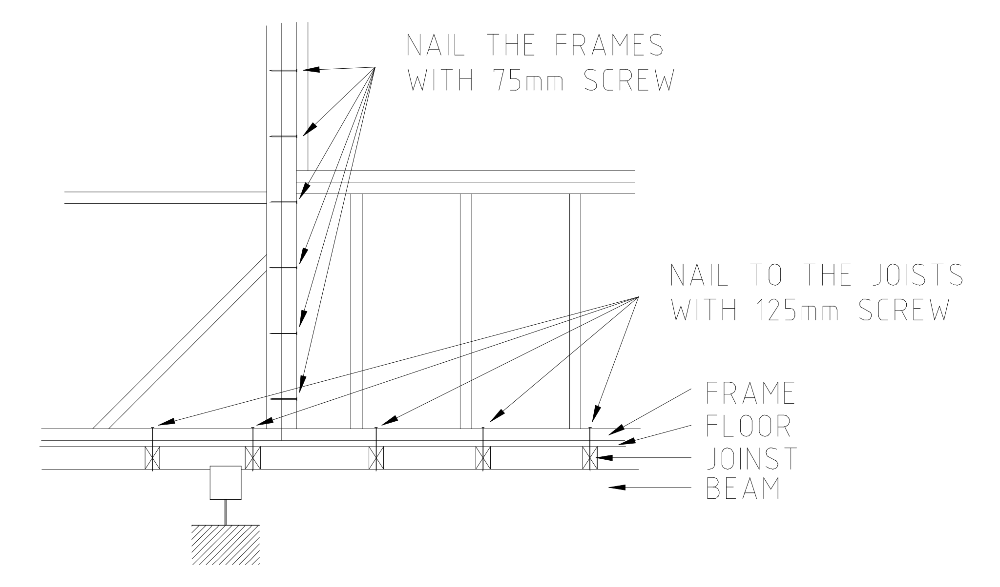
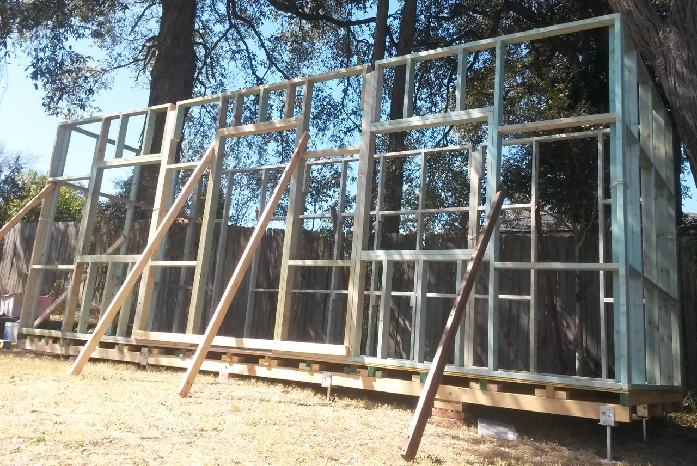
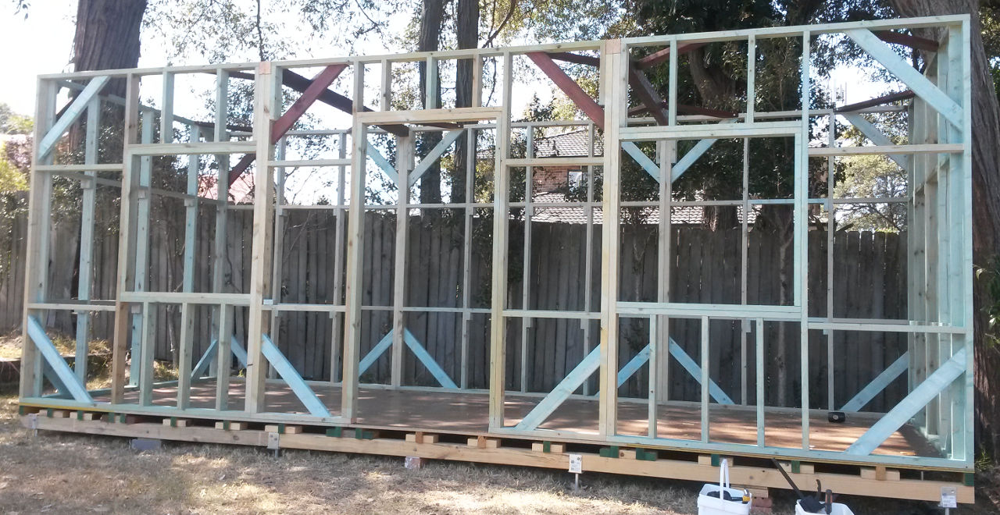

# The Frame of the Wall Structure

The dimension of the shed is 6235 * 2320 * 2400 in millimeters. 
Building a 6 meters wall frame would be quite challenging for a hobby project.
So I separated the wall frames to 8 pieces, each 4 square meters around.

Here is the frame plan in window line:

The CAD file can be found in <a href="./plan_frame.dxf">plan_frame.dxf</a>.

The 8 pieces are A1-A4, A4-A8, A8-A11, E1-E4, E4-E8, E8-E11 and two A-E.

<table>
  <tr>
    <td align="left"></td>
    <td align="center"></td>
    <td align="right"></td>
  </tr>
  <tr>
    <td align="left"></td>
    <td align="center"></td>
    <td align="right"></td>
  </tr>
  <tr>
    <td align="left"></td>
    <td align="center"></td>
    <td align="right"></td>
  </tr>
</table>

Note that
* Timber framings are graded structural pines. Most of them are 90x35mm.
* There are 8 pieces structural pines in A4, A8, E4 and E8 are 90x45mm.
* The 90x45mm notch in above panels, except the A-E panels, are made ready for the cross over beams.
* The cross over beams are also 90x45mm structural pines, 4 pieces all together.
* The 345mm extension in the upper panel of E1-E4 and E8-E11 are part of the roof structure.
* Each panel has some triangle supports. Do NOT tighten or install them before installation.

The A1-A4, A4-A8 and A8-A11 panel will form the front view of the shed. 
The plan can be found in <a href="./elevation_section_A.dxf">elevation_section_A.dxf</a>

The E1-E4, E4-E8 and E8-E11 panel will form the back view of the shed.
The plan can be found in <a href="./elevation_section_E.dxf">elevation_section_E.dxf</a>

The A-E panel will form the side view of the shed.
The plan can be found in <a href="./elevation_section_1.dxf">elevation_section_1.dxf</a>

When panels were being installed to the floor structure, the side of the panels would be nailed 
together by bolts or by screws. The bottom of the panels would be nailed down on the floor.
Note that the best practice is to screw to the joints. For examples:

When you are making these panels together, you probably need some temporary timbers to support
them in case of a sudden wind blow.

Once these frame panels being nailed together and secure on the floor, you may start to install
the triangle supports. The frame structure should be very stable even without the roof structure.

