# Install The Roof

## The Roof Enhancement

This shed has a single sloping roof. It's simpler and lighter than a pitched roof.
You even don't have to cut the Colorbond roof sheet.
However it's also not as strong as a pitched roof.
So before installing the roof, an enhancement structure need to be installed to 
improve its wind resistance.
The roof enhancement is combined by 12 triangle supports and 2 cross-over beams.
The plan can be found at <a href="plan_overhead.dxf">plan_overhead.dxf</a>

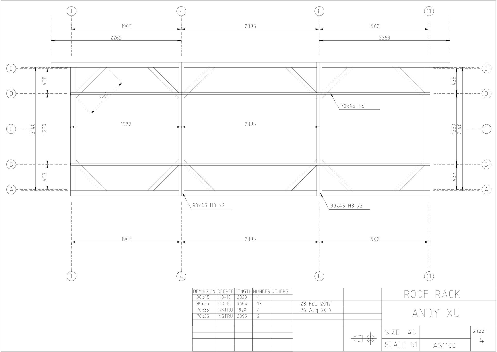

Please ignore the joints in B-B and D-D currently. They are not part of the enhancement but 
made ready for the shelf frames.

The triangle supports are installed in the top of the wall frames.
The cross-over beam in 4-4 and 8-8 are embedded into the wall frames. 

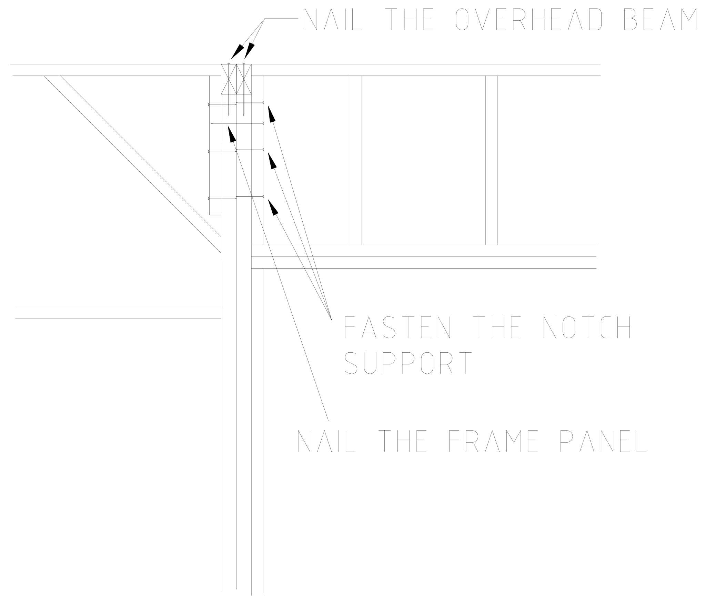

Each beam is combined by two 90x45 structural pines. 
I use the PVC glue and three M12 bolts to hold them together.
This structure can greatly improve the strength of the shed like a cage.
Actually the shed can stand still even the whole roof had been removed or replaced by other things.

Here are the detail pictures of the root enhancement.

<table>
  <tr>
   <td align="left">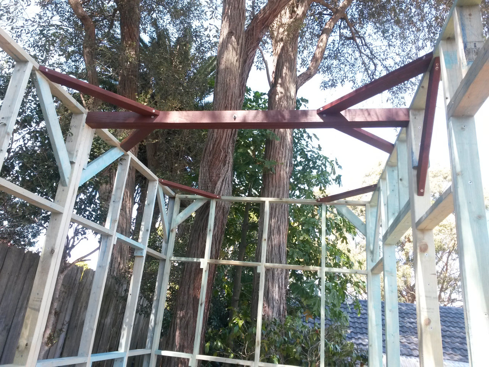</td>
   <td align="right">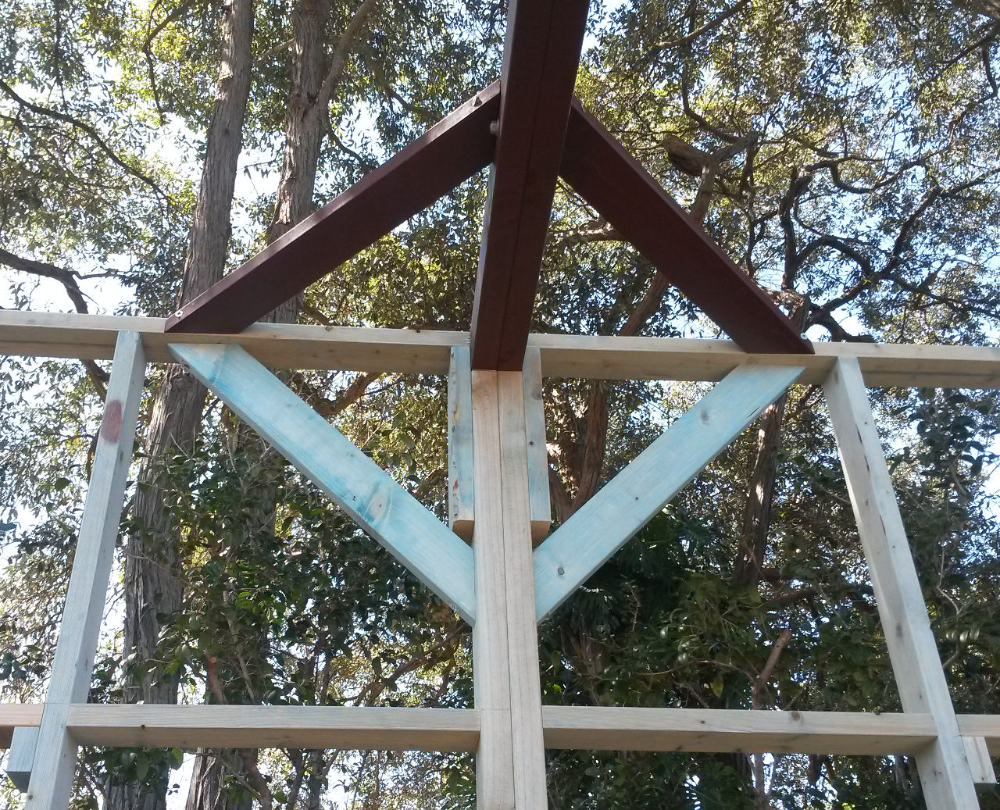</td>
  </tr>
</table>

## The Roof Structure

There is a roof frame, combined by three panels, installed in the front wall. 
All rafters are nailed on the top of the roof frame and the top of the back wall.
The roof frame is 300mm in height so making the front wall 300mm higher than the back wall. 
Here is the structure of the roof frame.

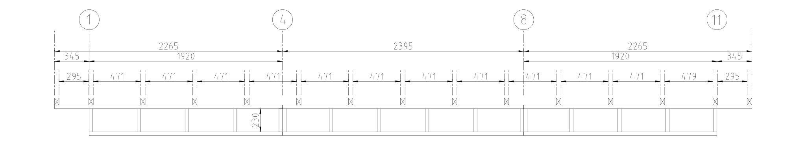

The roof frame is combined by three panels, just like the wall frames, which nailed together
and nailed onto the front wall frames.

<table>
  <tr>
   <td align="left">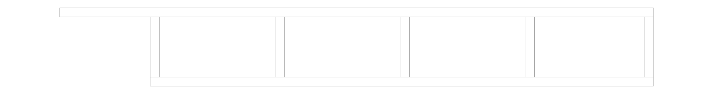</td>
   <td align="center">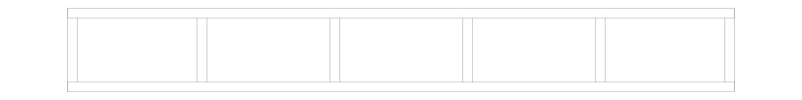</td>
   <td align="right">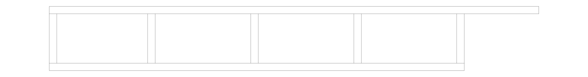</td>
  </tr>
</table>

When the roof frame is installed on the front wall, the whole structure is:

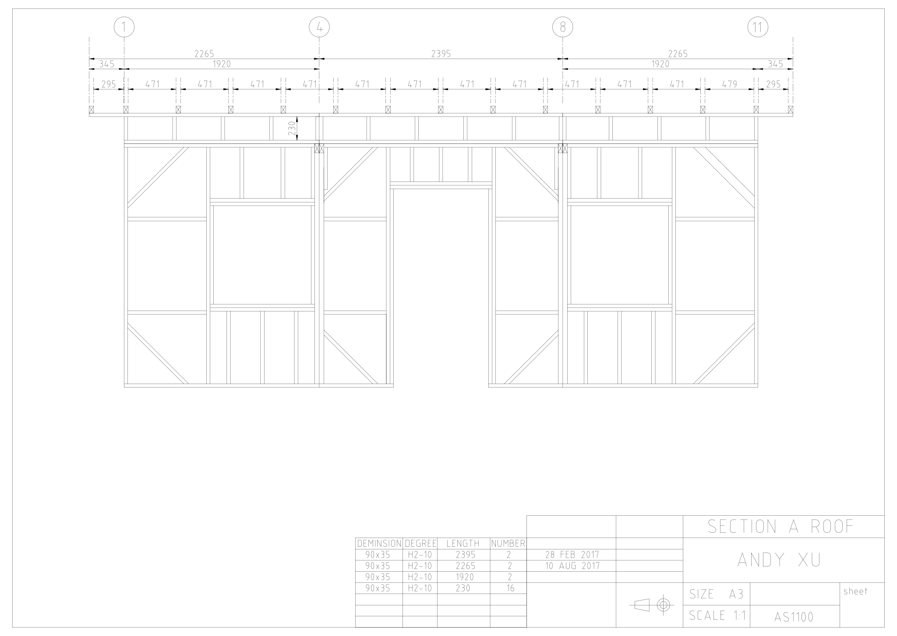

The plan can be found at <a href="elevation_roof_front.dxf">elevation_roof_front.dxf</a>.

The rafters are 70x45mm, 3 meters long structural timbers. 
The roof is quite small so I took away the joints, seated the roof sheet directly on the rafters.

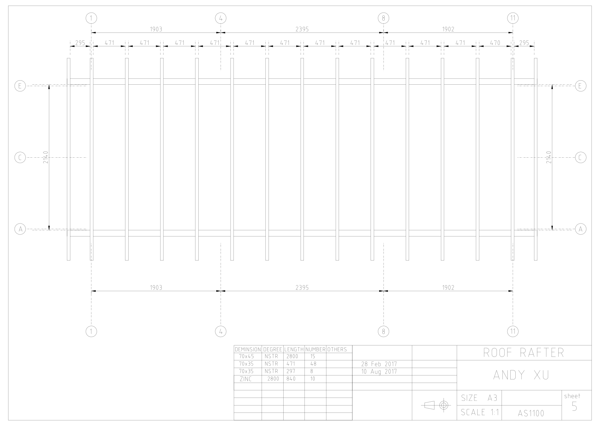

The plan can be found at <a href="plan_rafter.dxf">plan_rafter.dxf</a>.

This is the side view at side wall A-E. You can see the slope roof rafter here.

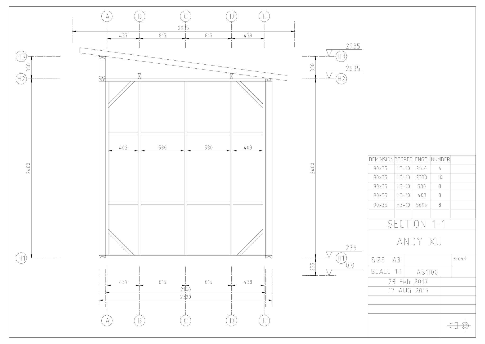

This is the profile view at the cross-over beam 8-8:

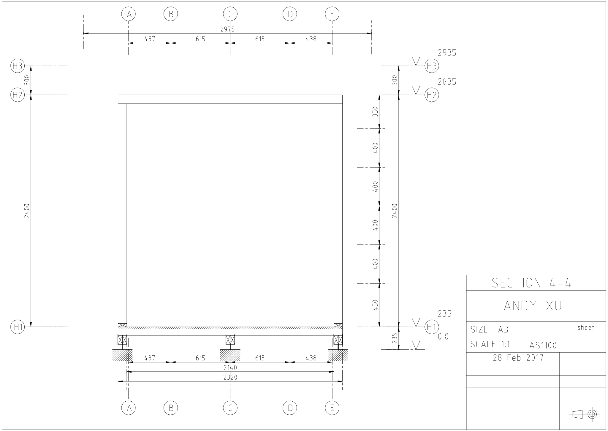

The side view plan can be found at <a href="elevation_side.dxf">elevation_side.dxf</a>.

Here are the picture on site about the roof structure:

<table>
  <tr>
   <td align="left">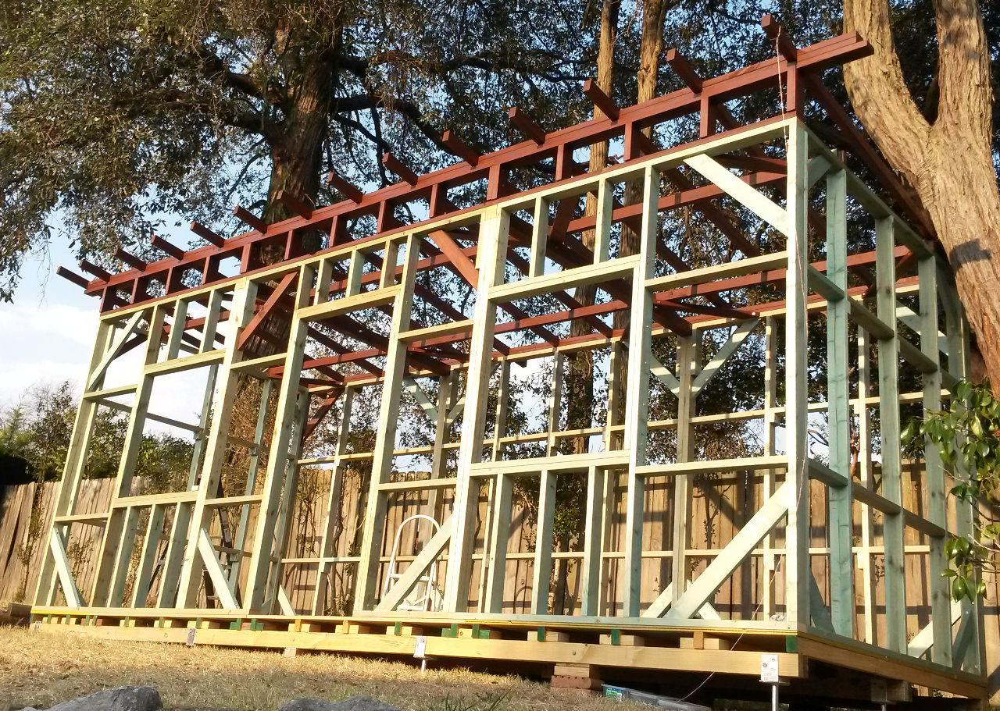</td>
   <td align="right">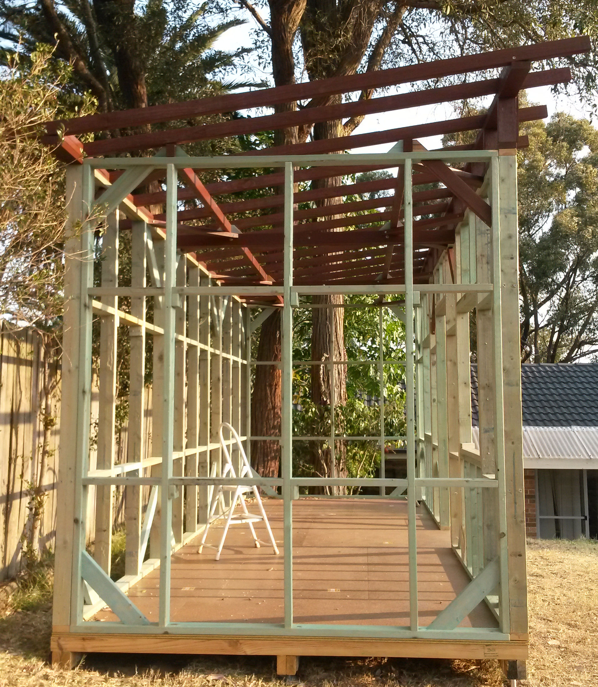</td>
  </tr>
</table>

Once the roof structure is completed, the roof sheet can be installed immediately.
I used the corrugated metal roofing called COLORBOND. The in-store dimension is 3000x840mm
so I simply took 10 sheets installed without cutting.

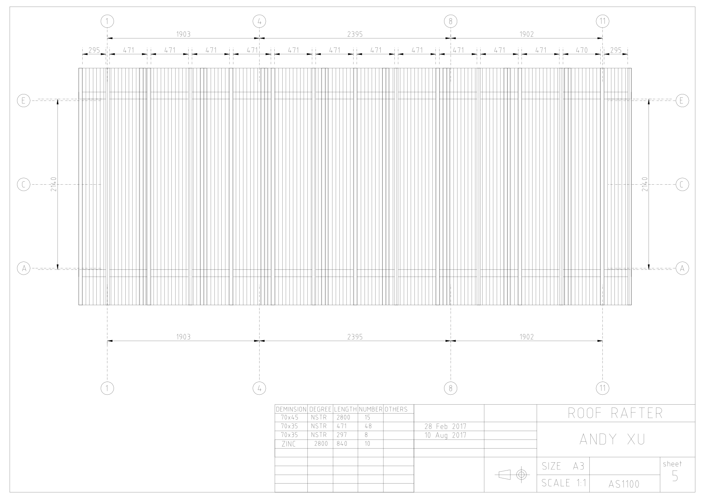

Note that the screws must be roofing screws which have a rubber washer to prevent the rain water.
The screws must be fixed on the crest.

<table>
  <tr>
   <td align="left">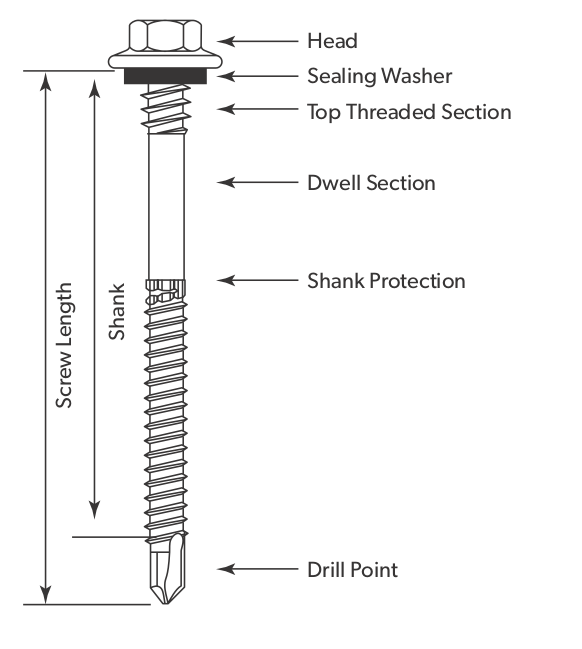</td>
   <td align="right">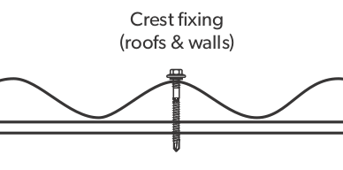</td>
  </tr>
</table>

Here is what the roofing look like:

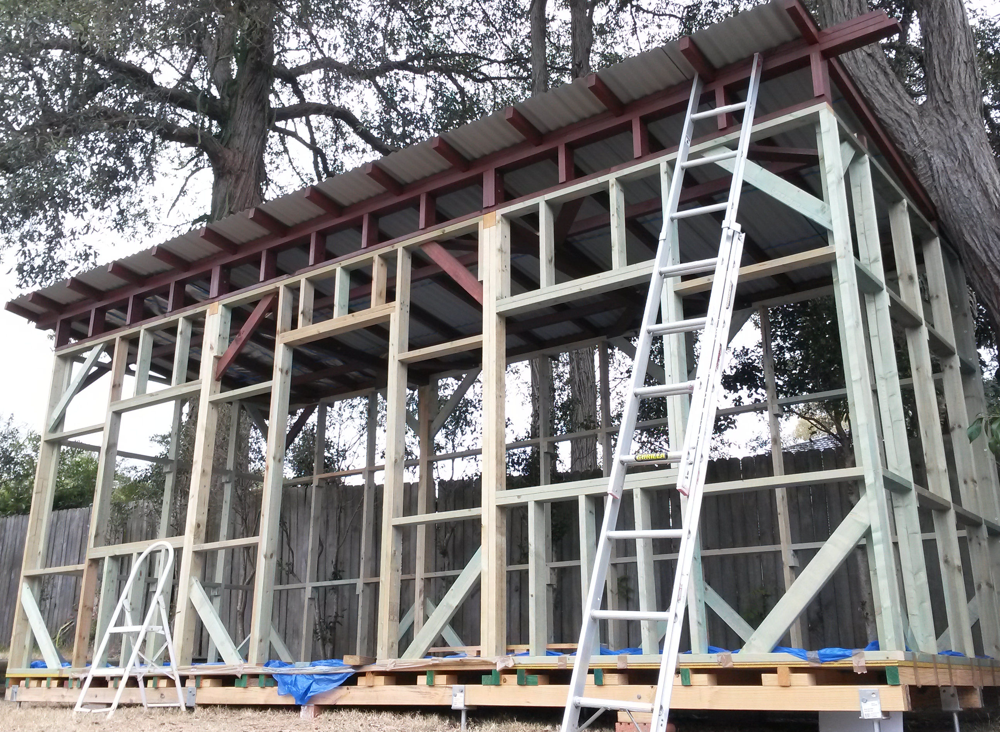

