# Timber Cladding

The choise of cladding is vast. You are free to use anything as long as they resist wind and water.
I used to use blue board, which was cheap but a lot heavier, or plywood, which looked nice but needed 
to be carefully painted. This time I chosed the traditional cedar weatherboard cladding, the Beveled Siding.
It's not just low price for itself. The repairing or replacing is also much easier.

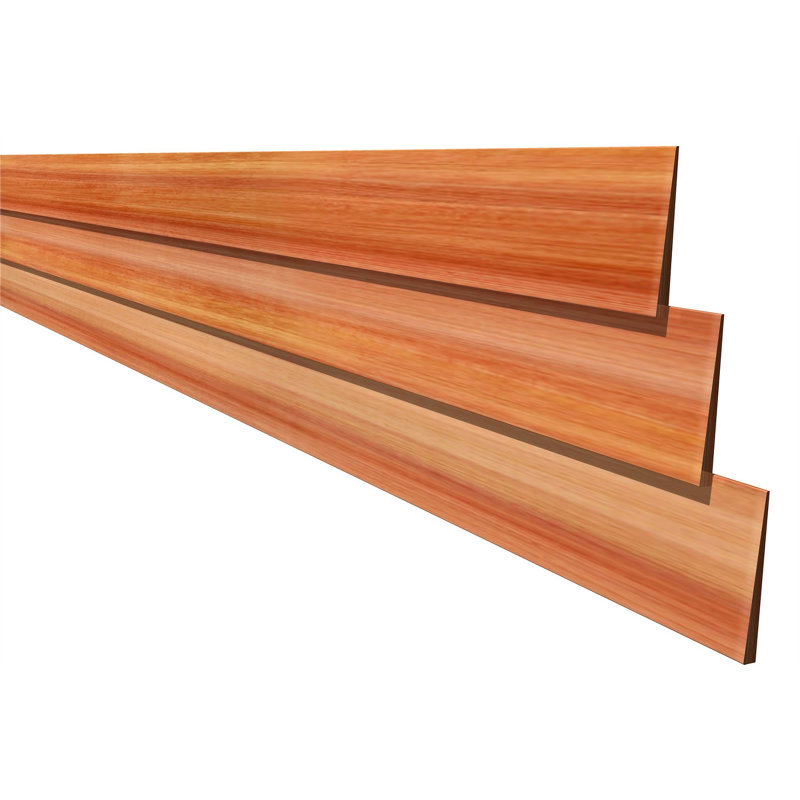

## The Extra Supports

Before the cladding timber, the extra supports should be installed to brace the weatherboard. 
Precisely, some joinsts should be installed around the window frames and the door frame.
Or generally, anywhere between the studs where the weatherboards lands on.

The extra supports around doors and window frames shows below. The left one is the extra supports
and the right one is how the extra supports look in the whole structure.

<table>
  <tr>
     <td align="left">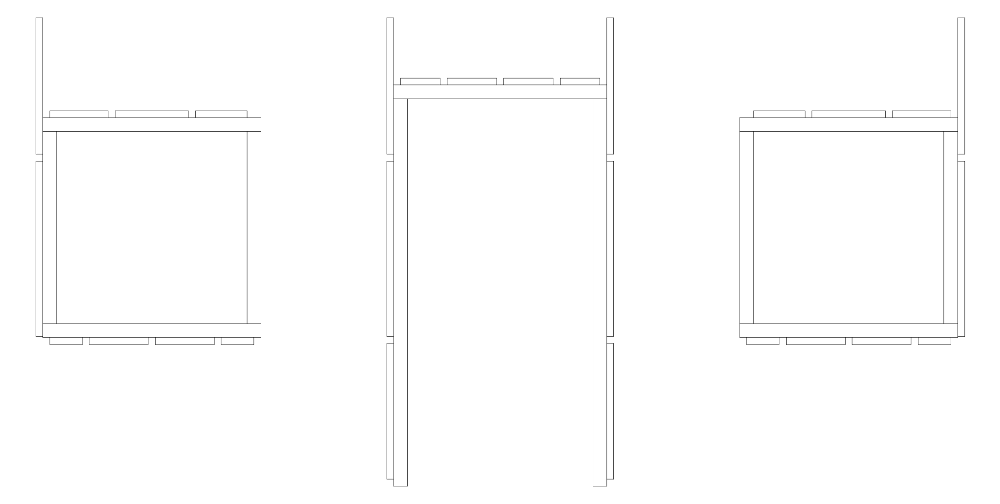</td>
     <td align="right">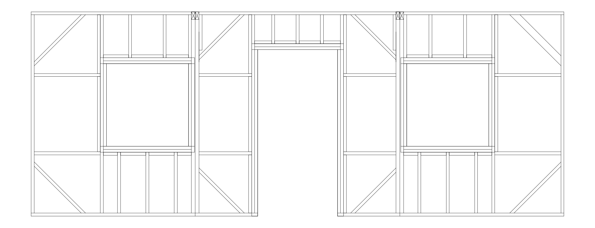</td>
</tr>
</table>

You may also add some simple decoration timbers to hold the weather board in position.
Usually they are in the cornor or in the door and windows frames. The decoration timbers
can be as simple as 70x35mm structural one.

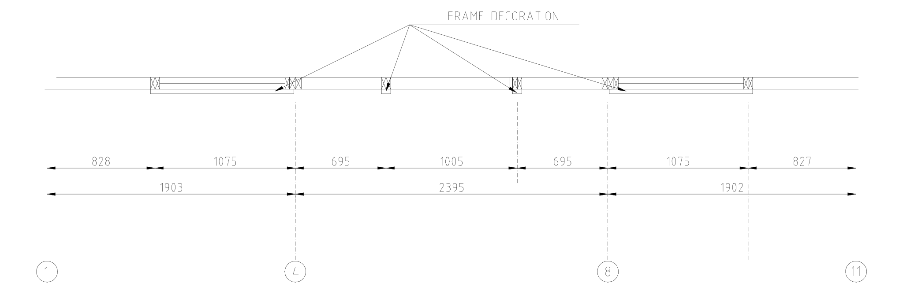

## The Insulation Membrane

The building membrane is not commonly used in small project like the garden shed.
I installed the insulation membrane because I planned to install some internal boards
so the membrane can be a barrier to radiant heat, keep warm and provides a physical 
layer to protect against water and air infiltration. I chosed this kind of film:

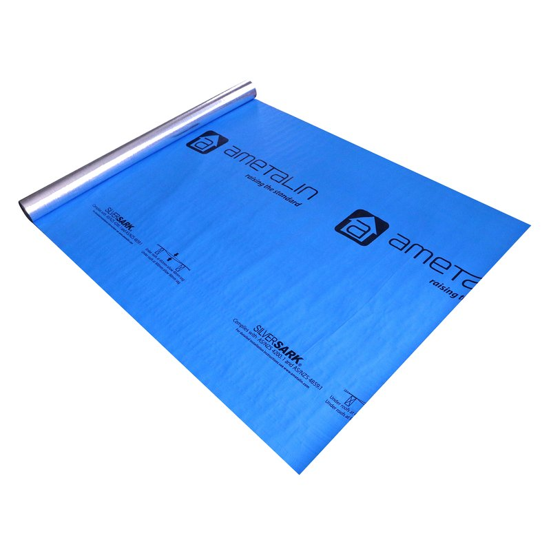

It looked like this before cladding:

<table>
  <tr>
     <td align="left">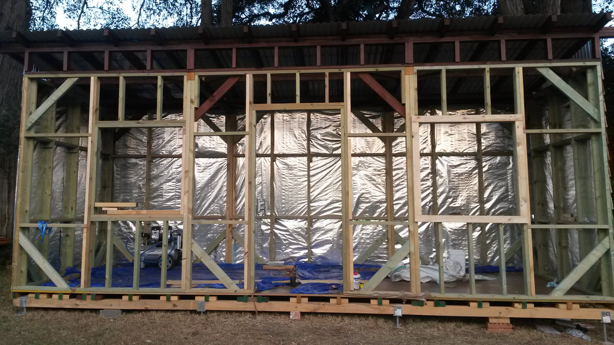</td>
     <td align="right">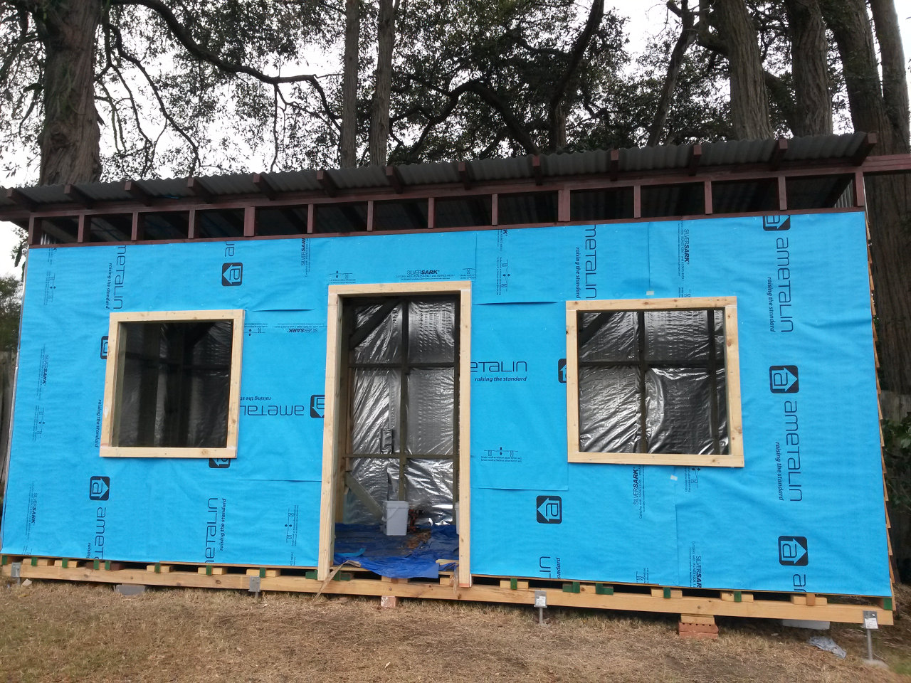</td>
</tr>
</table>

## Cladding

Cladding is fairly simple, just nail these boards piece by piece to studs.
Here is the plan:

<table>
  <tr>
     <td align="left">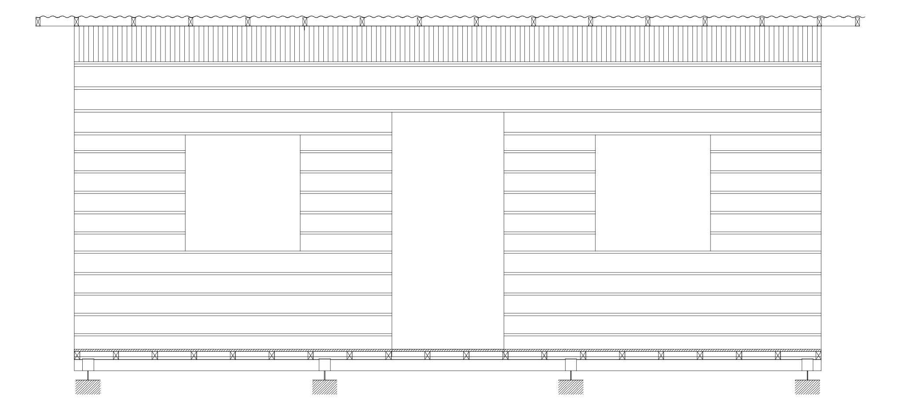</td>
     <td align="right">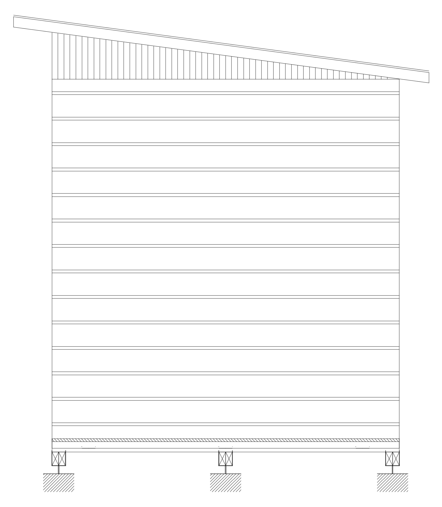</td>
</tr>
</table>

Note that roof structure was not cladding of weather boards. 
I used the polycarbonate roofing sheet instead.

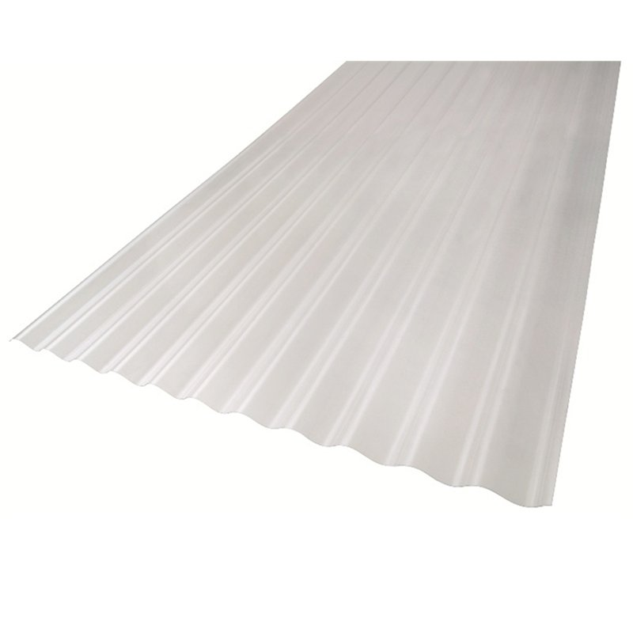

It's cheaper than glass and much easier to cut.
It can be installed to the roof structure with roofing screw.

<table>
  <tr>
     <td align="left">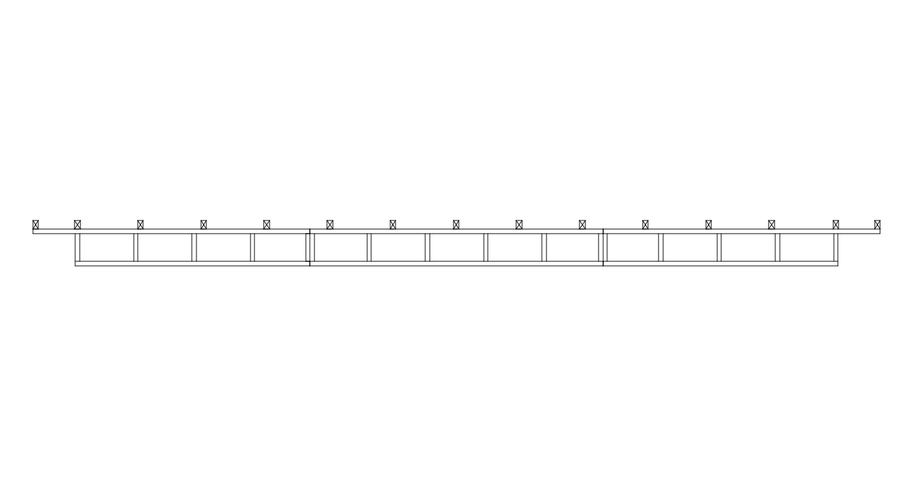</td>
     <td align="right">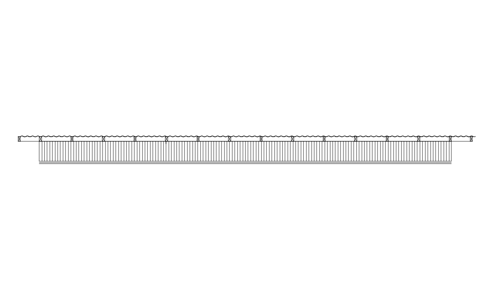</td>
</tr>
</table>

The picture shows the progress of the cladding

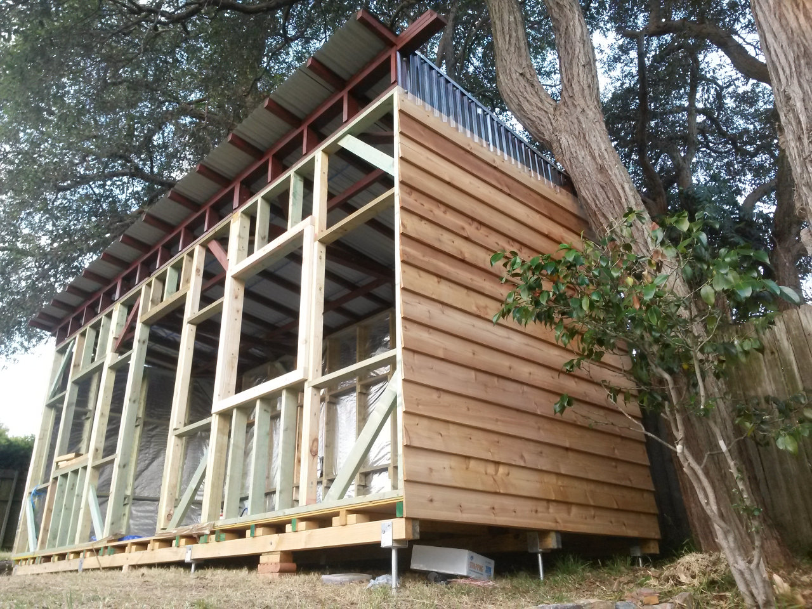

