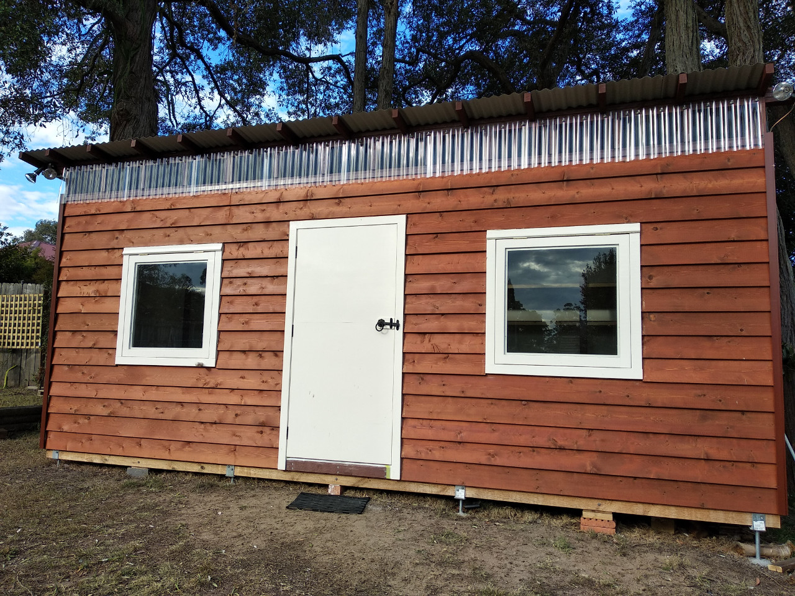
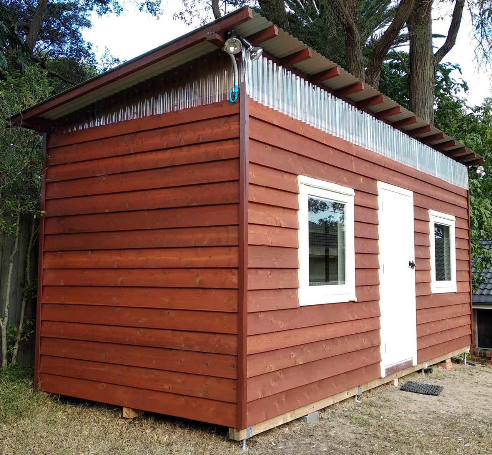
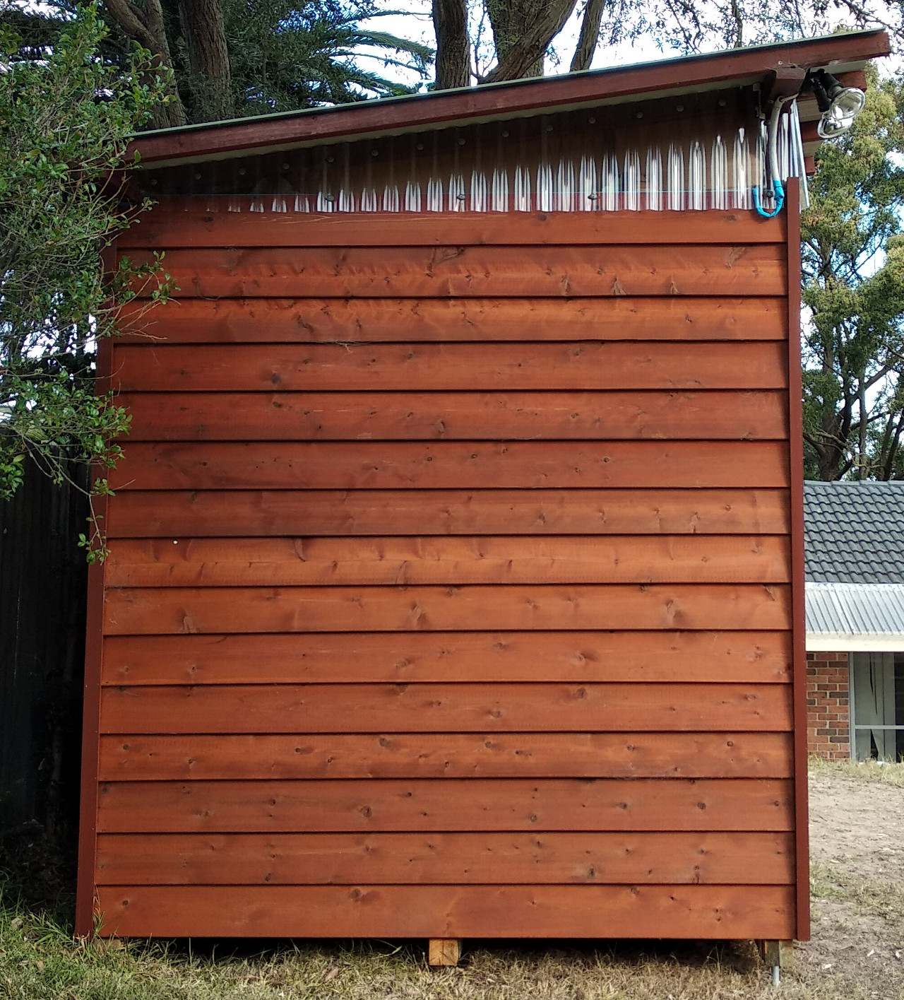

# Wood Shed -- Howto build a wood shed

This project shares my plan, progress and experience to build a small garden shed 
with wood frames and cladding. The roof is ColorBond metal and the foundation is
post anchor and concrete. The area is roughly 6 meters by 2.4 meters and the height
is 3 meters. The BOM budget was $4000 AUD and apparently was overrun, 
not sure the detail number, perhaps by 30%-40%. 

Most important part in this project is the plan made with LibreCAD. 
If you are a computer monkey who knows CAD software pretty well, and willing to
do some manual work in your backyard to kill some weekends, this project could be
a good start for you. You can easily shape it to fit your purpose.
If you don't know how to use LibreCAD, you may still find some useful references
from this project. I'll also export some PDF file from the plan.

## Motivation

I need a shed to host garden tools, being storage room and a sometime study room.
Metal shed is cheap but need the concrete slab to be assembled. Wood shed could be
an easy target because you can find all materials at local stores, DIY knowledge
from website and details from YouTube.

## Disclaimer

This project is released under MIT License. Please find the attached LICENSE file.

This project is just for fun and for non-commercial use. All information 
in this project were deduced from basic physics or searched from websites. 
I am no architecture nor home builder. There is absolutely no warranty for the project.

There are some URLs and products descriptions linked to some commercial websites.
Those are all examples for helping understanding. There is no advertisement or 
promotion for ANY commercial entities. You are free to choose any suppliers for 
any brands of products.

When you get into the construction, do not forget to wear the proper protections
like helmet, goggles, etc. Be extremely careful with power saws and air tools,
which could easily cut some fingers off in no time. Be extremely careful with 
power lines, which could cause fire or even electrocution. Keep kids and dogs away
from work site.

Before you start, check with your local council to make sure the shed can be legally built.
Different council has different regulations regarding to the dimension.

The frame section is 90x35mm and the space is based on 600mm, which is commonly 
used in house building. However I do not know how strong it can resist against the wind
so please do not build it in tornado area.

