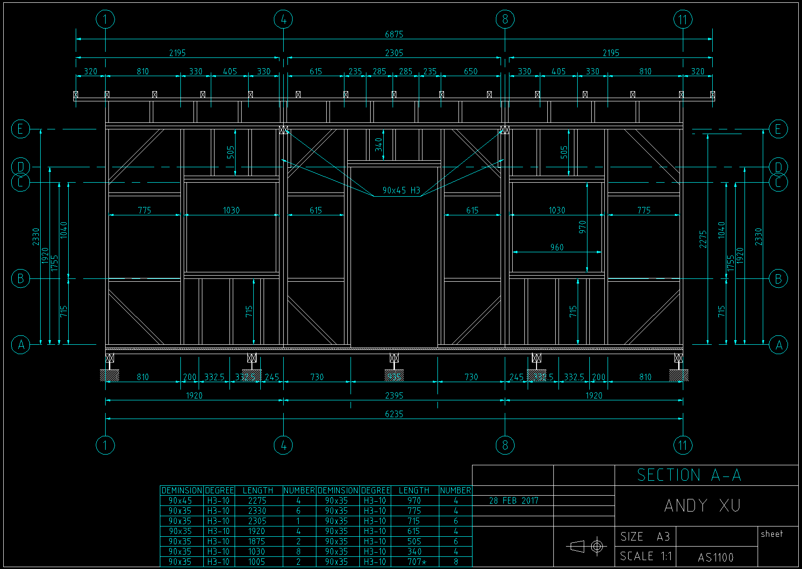
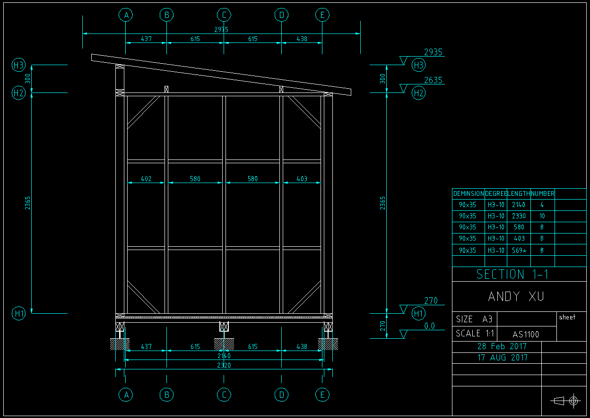
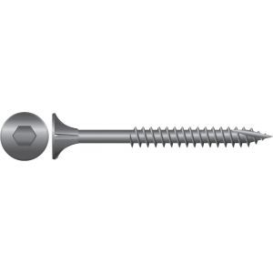
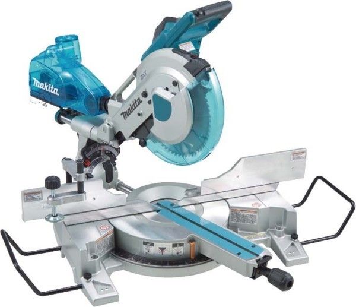
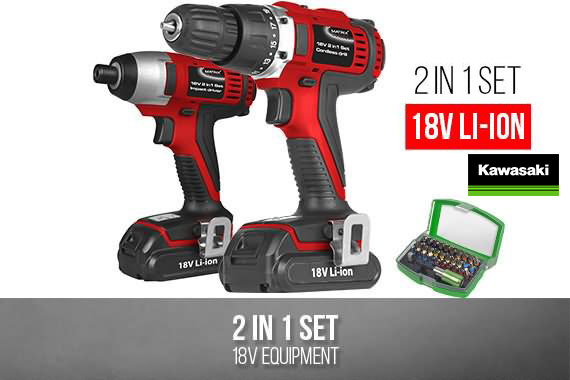
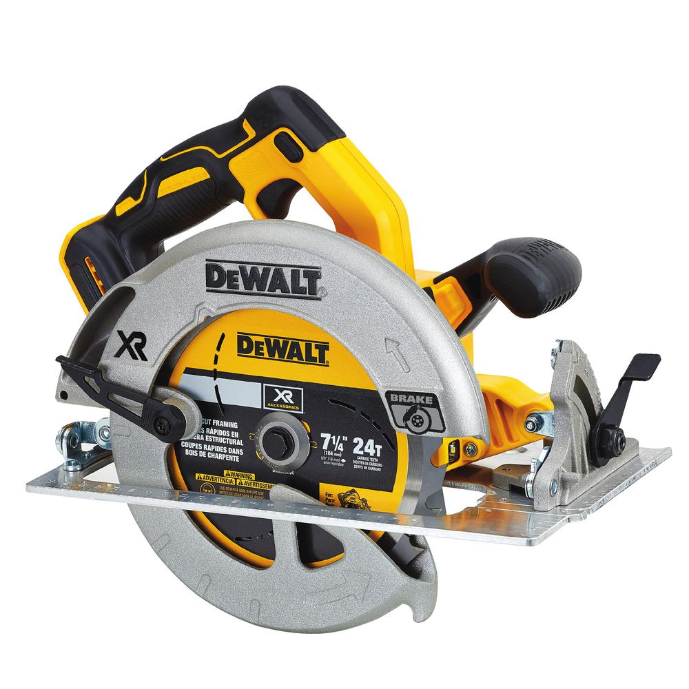
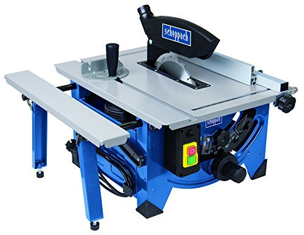
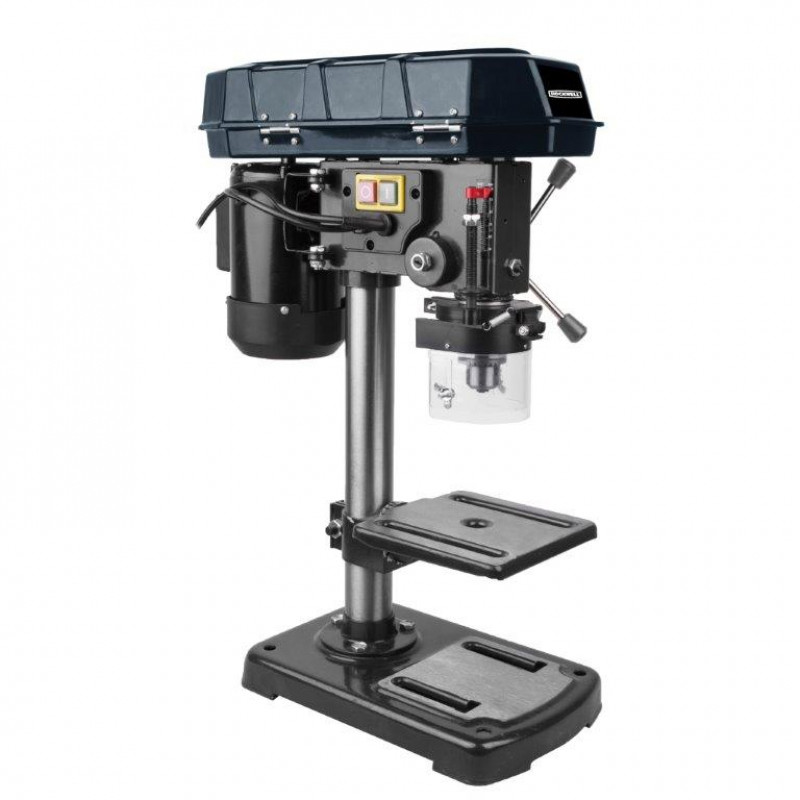

# Wood Shed -- Howto build a wood shed

<table>
  <tr>
    <td colspan="2"></td>
  </tr>
  <tr>
    <td align="left"></td>
    <td align="right"></td>
  </tr>
  <tr>
    <td align="left"></td>
    <td align="right"></td>
  </tr>
</table>

This project shares my plan, progress and experience to build a small garden shed 
with wood frames and cladding. The roof is ColorBond metal and the foundation is
post anchor and concrete. The area is roughly 6 meters by 2.4 meters and the height
is 3 meters. The BOM budget was $4000 AUD and apparently was overrun, 
not sure the detail number, perhaps by 30%-40%. 

Most important part in this project is the plan made with LibreCAD. 
If you are a computer monkey who knows CAD software pretty well, and willing to
do some manual work in your backyard to kill some weekends, this project could be
a good start for you. You can easily shape it to fit your purpose.
If you don't know how to use LibreCAD, you may still find some useful references
from this project. I'll also export some PDF file from the plan.

## Motivation

I need a shed to host garden tools, being storage room and a sometime study room.
Metal shed is cheap but need the concrete slab to be assembled. Some wood sheds 
can be purchased from store. But they are not suitable for the slope.
Apparently whatever I do I need to build a flat foundation first. The easiest
way to build a foundation is deck foundation, just some anchor posts and timbers.
Naturally it would be quite strong if stick some timber frames on the timber
foundation and a shed could come into being, just need to do some detail design.
LibreCAD is a cross platform open sourced 2D CAD software which is perfect for 
my purpose. It supports layers so you can easily see through different profiles.
It is also convenient to design something not available in Internet, like this
one, had a 3:1 length width ratio.

## Disclaimer

This project is released under MIT License. Please find the attached LICENSE file.

This project is just for fun and for non-commercial use. All information 
in this project were deduced from basic physics or searched from websites. 
I am no architecture nor home builder. There is absolutely no warranty for the project.

There are some URLs and products descriptions linked to some commercial websites.
Those are all examples for helping understanding. There is no advertisement or 
promotion for ANY commercial entities. You are free to choose any suppliers for 
any brands of products.

When you get into the construction, do not forget to wear the proper protections
like helmet, goggles, etc. Be extremely careful with power saws and air tools,
which could easily cut some fingers off in no time. Be extremely careful with 
power lines, which could cause fire or even electrocution. Keep kids and dogs away
from work site.

Before you start, check with your local council to make sure the shed can be legally built.
Different council has different regulations regarding to the dimension.

The frame section is 90x35mm and the space is based on 600mm, which is commonly 
used in house building. However I do not know how strong it can resist against the wind
so please do not build it in tornado area.

## Files and Folders

Note that for some reason these .dxf files may suffer display issue in LibreCAD 2.1.x.
By such circumstance please try open them with LibreCAD 2.0.x.

    .
    ├── 01_foundation           # the design and details of the foundation and floor.
    ├── 02_frames               # the design and details of the structural frames.
    ├── 03_roof                 # the design and details of the roof structure.
    ├── 04_cladding             # the design and details of the timber cladding.
    ├── 05_interior             # some details of the interior design and utility shelf.
    ├── elevation_front.dxf     # the all in one CAD of the elevation in the front view.
    ├── elevation_side.dxf      # the all in one CAD of the elevation in the side view.
    ├── plan.dxf                # the all in one CAD of the plan view.
    ├── supply.ods              # the pretty rough BOM breakdown, don't rely on its price list.
    ├── images
    ├── LICENSE
    └── README.md

## Nail or Drill

When fastening timber frames, joinsts or beams together, professional trademen
prefer to use nails. The cost is low, probably $20/1000 nails. It's super fast
with an air nailer, for example, the project like the shed can be done in one day
in an experienced hand. However nailing is not as simple as it looks like. 
It needs skill. The nails could be bent or crooked. Thumbs are always under threaten.
Air nailer is not easy to use either. I have a compressor and frame nailer
and found it's quite hard to control the accuracy and direction. It always goes to
the unexpected place. It's heavy and loud, sometimes splits timbers. 
I reckon one needs thousands of nailing practise to get used to that.

Finally I gave up the frame nailer, I still use brad nailer by the way, but using
screws instead. Screws are very strong and very easy to control. It's accurate because
there's no impact while driving. It needs more money than nails, yet still only 
a tiny part in the whole project. Positively thinking, when you don't need the 
shed any longer, in theory it could be disassembled with a screwdriver.

For better performance, I recommands the Bugle Head Batten Screw, galvanised, 
heavy duty 14 gauge with hexagonal key drive head for high torque fastening.
Perfect for the 18V screwdriver.

Most frame timber can be done with 65mm screws. The 100mm screws used to fasten
the frame on the floor. The overcross beam is 90x90 so there are 16 screws 
to be 125mm+. To get an accurate screwing, I always drill a pilot hole before
driving. For those longer than 100mm, the very long drill is needed.

## Power Tools in Need

Those power tools are very important to save your time and efforts. 
The professional tools are certainly the best. 
However even the cheapest one will also be the great helper.
The followed list is not a shopping guide. All pictures and brands are references only.
You may choose whatever you'd like in your local suppliers within your budget.

* Mitre saw is a must-have. It can easily cut timbers in 90 degree or 45 degress accurately in seconds.

* 18V drill set, normally includes an impact drill and screw driver. 
The 18V drill set are amazingly powerful and portable. I used it to drive a 150mm screws quite often
while 10V driver simply stuck.

* Circular saw is almost the every-one-saw. You will need it when you cut the floor board.
It's light and easy to use. Sometimes it's more flexible when cutting large area boards.

* Table saw is optional. It's more accurate than circular saw especially while cutting 
narrow or strip of boards. You will find it's much quicker while cutting the cladding board in length.

* Drill press is optional. It helps to drill a vertical hole accurately. 
Perfect for the obsessive-compulsive personality.

